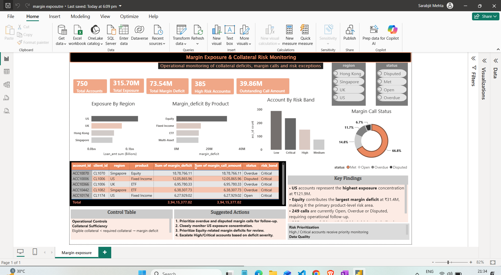

# Margin Exposure & Collateral Risk Monitoring Dashboard

## 📌 Project Overview

An operational risk analytics project designed to monitor collateral exposure, margin deficits, margin calls, and high-risk accounts across regions and financial products.

The project combines SQL-based analysis with an interactive Power BI dashboard to identify exposure concentrations, prioritize margin-related risks, and support operational follow-up.

---

## 🎯 Business Problem

Financial institutions need to continuously monitor client collateral and margin positions to identify accounts that may require additional collateral or operational intervention.

The objective of this project is to provide a consolidated view of:

- Total account exposure
- Margin deficits
- Outstanding margin calls
- High-risk accounts
- Regional exposure concentration
- Product-level margin risk
- Margin call status
- Risk-band distribution

The analysis helps operational teams identify where risk is concentrated and which accounts require priority attention.

---

## 🎯 Project Objectives

- Monitor total exposure across client accounts
- Identify accounts with significant margin deficits
- Analyze exposure across different regions
- Compare margin deficits across financial products
- Track margin call status and outstanding call amounts
- Segment accounts by risk band
- Identify high-risk accounts requiring follow-up
- Translate analytical findings into actionable operational recommendations

---

## 🛠️ Tools & Technologies

- **SQL** – Data exploration, transformation, aggregation and analysis
- **Power BI** – Interactive dashboard and visualization
- **Microsoft Excel / CSV** – Source data preparation
- **GitHub** – Project documentation and version control

---

## 📊 Dataset

The project uses account-level financial risk data containing information related to:

- Account ID
- Client ID
- Region
- Financial Product
- Exposure / Loan Amount
- Margin Deficit
- Margin Call Amount
- Margin Call Status
- Risk Band

The dataset contains **750 accounts** across four regions:

- US
- UK
- Singapore
- Hong Kong

---

## 🔍 SQL Analysis

SQL was used to analyze the underlying account-level data and generate metrics required for risk monitoring.

### Key analysis areas

- Total account exposure
- Total margin deficit
- Margin call amounts
- High-risk account identification
- Exposure by region
- Margin deficit by product
- Account distribution by risk band
- Margin call status analysis
- Identification of accounts requiring operational follow-up

### SQL concepts used

- SELECT
- WHERE
- GROUP BY
- HAVING
- CASE WHEN
- Aggregate Functions
- JOINs
- Subqueries
- CTEs
- Window Functions
- ORDER BY

SQL queries are available in:

`sql/margin_analysis.sql`

---

## 📈 Power BI Dashboard

The dashboard provides an operational monitoring view of collateral and margin-related risk.

### Key KPIs

- **750** Total Accounts
- **315.70M** Total Exposure
- **73.54M** Total Margin Deficit
- **385** High-Risk Accounts
- **39.86M** Outstanding Call Amount

### Key Visualizations

#### Exposure by Region
Shows how total exposure is distributed across the US, UK, Hong Kong, and Singapore.

#### Margin Deficit by Product
Highlights which financial products contribute most significantly to the overall margin deficit.

#### Accounts by Risk Band
Segments accounts into Low, Medium, High, and Critical risk categories.

#### Margin Call Status
Shows the distribution of margin calls across Met, Open, Overdue, and Disputed statuses.

#### Account-Level Risk Table
Provides account-level visibility into:

- Account
- Client
- Region
- Product
- Margin Deficit
- Margin Call Amount
- Status
- Risk Band

#### Interactive Filters

The dashboard allows users to filter the analysis by:

- Region
- Margin Call Status

---

## 💡 Key Business Findings

- **US accounts represent the highest exposure concentration**, with approximately **121.9M** in exposure.
- **Equity contributes the largest margin deficit**, at approximately **31.4M**, making it the primary product-level risk area.
- **249 margin calls are currently Overdue or Disputed**, requiring operational follow-up.
- **385 accounts are classified as high risk**, highlighting a significant portion of the portfolio requiring enhanced monitoring.
- High and Critical risk accounts should receive priority monitoring based on margin deficit severity and outstanding call status.

---

## 🚨 Risk Prioritization

The analysis supports a practical risk-prioritization approach:

1. Prioritize **overdue and disputed margin calls** for follow-up.
2. Closely monitor **US exposure concentration**.
3. Prioritize **Equity-related margin deficits** for review.
4. Escalate **High and Critical risk accounts** based on deficit severity.
5. Monitor accounts with significant outstanding margin call amounts.

---

## 📋 Operational Control Logic

The dashboard includes a control framework for identifying potential collateral deficiencies:

**Eligible Collateral < Required Collateral → Margin Deficit**

Accounts meeting this condition require additional monitoring or operational action.

---

## 📊 Dashboard Preview



---

## 📁 Project Structure

```text
margin-exposure/
│
├── README.md
│
├── sql/
│   └── margin_analysis.sql
│
├── data/
│   └── margin_exposure_risk_monitoring.csv
│
└── dashboard/
    └── Margin_Exp&Col_Risk.png
